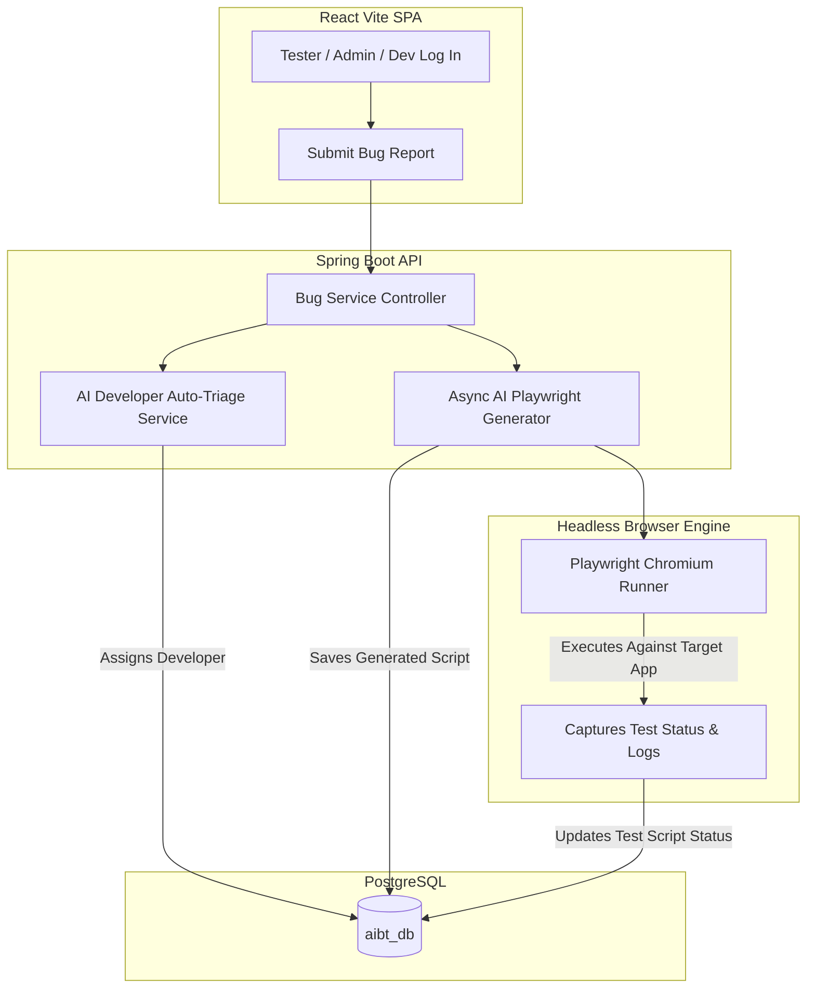

# 🚀 AI-Bug Tracker

A full-stack, autonomous bug tracking system powered by **Spring Boot (Java 17)**, **React (Vite SPA)**, **PostgreSQL**, **Google Gemini / DeepSeek AI**, and **Playwright E2E Browser Automation**.

The application streamlines issue management by combining traditional role-based bug tracking with **AI-driven developer auto-triage**, **automated Playwright end-to-end test generation**, and **headless browser test execution**.

---

## 🛠️ Architecture & Workflow



---

## 🌟 Key Features

* **🤖 AI Auto-Triage & Developer Assignment**: Reads natural-language bug descriptions and automatically assigns issues to matching developers (e.g., UI issues to Frontend Devs, database queries to Backend Devs).
* **⚡ Automated Playwright Test Generation**: AI acts as an automated QA engineer, generating standalone Node.js Playwright JavaScript E2E test scripts to reproduce and verify reported bugs.
* **🧪 Headless Chromium Test Execution**: Runs Playwright scripts in real-time against target URLs, logging console outputs, stack traces, and recording `PASS` / `FAIL` status badges.
* **👥 Role-Based Access Control (RBAC)**: Scoped dashboards tailored for **Admins**, **Developers**, and **Testers**.
* **🎨 Clean Light Mode UI**: Designed with Apple / Stripe aesthetic, featuring **Plus Jakarta Sans** and **JetBrains Mono** typography.
* **🐳 Dockerized Architecture**: Includes single-command multi-container deployment via `docker-compose.yml`.

---

## 💻 Tech Stack

* **Backend**: Java 17, Spring Boot 3, Spring Security (JWT), Spring Data JPA, Hibernate, RestTemplate
* **Frontend**: React 18, Vite, React Router v6, CSS Modules, FontAwesome Icons
* **Database**: PostgreSQL 15 (`aibt_db`)
* **AI Provider**: Google Gemini API / DeepSeek API (REST integration)
* **Test Runner**: Node.js, Playwright Chromium Browser (`@playwright/test`)
* **Containerization**: Docker, Docker Compose

---

## 🔐 Default Seeded Accounts

When the Spring Boot server starts, the database is seeded with default role-based accounts:

| Role | Name | Email | Default Password |
|---|---|---|---|
| 🛡️ **ADMIN** | Admin User | `admin@bugtracker.com` | `admin123` |
| 🎨 **DEVELOPER** | Alice Dev | `alice@bugtracker.com` | `dev123` |
| ⚙️ **DEVELOPER** | Bob Dev | `bob@bugtracker.com` | `dev123` |
| 🧪 **TESTER** | Jane Tester | `jane.tester@example.com` | `Password123!` |

---

## 🚀 Local Setup & Installation

### 1. Prerequisites
Ensure you have the following installed on your machine:
* **Java 17** (`java --version`)
* **PostgreSQL 15** (`psql --version`)
* **Node.js 18+** (`node --version`)
* **npm** (`npm --version`)

### 2. Database Setup

```sql
CREATE DATABASE aibt_db;
CREATE USER aibt_user WITH PASSWORD 'aibt_pass';
GRANT ALL PRIVILEGES ON DATABASE aibt_db TO aibt_user;
```

### 3. Environment Variables
Set your AI API Key in your environment:

```bash
export DEEPSEEK_API_KEY=sk-your-actual-api-key-here
export DEEPSEEK_MODEL=deepseek-v4-pro        # optional
export DEEPSEEK_TEMP=0.3                      # optional
```

### 4. Playwright Test Engine Setup
Initialize the Playwright execution directory:

```bash
mkdir -p /tmp/aibt && cd /tmp/aibt
npm init -y
npm install @playwright/test playwright
npx playwright install chromium
```

### 5. Run Spring Boot Backend
From the root directory:

```bash
./mvnw spring-boot:run
```
* Backend API starts at `http://localhost:8080`.

### 6. Run React Frontend
In a new terminal tab:

```bash
cd frontend
npm install
npm run dev -- --port 3002
```
* Frontend SPA runs at `http://localhost:3002`.

---

## 🐳 Docker Deployment

To launch the full stack (Frontend, Backend, and PostgreSQL) together:

```bash
docker-compose up --build
```

---

## ☁️ Free Cloud Deployment Blueprint

You can deploy the entire application 100% for free using serverless cloud platforms:

1. **🎨 Frontend (React)**: Deploy to [Vercel](https://vercel.com/) (Root folder: `frontend`).
2. **🗄️ Database (PostgreSQL)**: Deploy to [Neon.tech](https://neon.tech/) (Free managed serverless DB).
3. **⚙️ Backend (Spring Boot)**: Deploy to [Render.com](https://render.com/) (Free Docker Web Service).

---

## 📡 API Reference

### Authentication & Users
| Method | Endpoint | Auth | Description |
|---|---|---|---|
| `POST` | `/api/auth/signup` | Public | Register new tester account |
| `POST` | `/api/auth/login` | Public | Authenticate user & return JWT token |
| `POST` | `/api/auth/logout` | JWT | Invalidate user session token |
| `GET` | `/api/users` | JWT (ADMIN) | List all registered users |
| `PUT` | `/api/users/{id}` | JWT (ADMIN) | Update user details or roles |

### Bugs & AI Test Execution
| Method | Endpoint | Auth | Description |
|---|---|---|---|
| `GET` | `/api/bugs` | JWT (Scoped) | Get bugs (Admin=All, Dev=Assigned, Tester=Created) |
| `GET` | `/api/bugs/{id}` | JWT | Get bug details by UUID |
| `POST` | `/api/bugs` | JWT | Submit new bug report (triggers AI Triage & Test Generator) |
| `PUT` | `/api/bugs/{id}` | JWT (ADMIN) | Update bug details |
| `DELETE` | `/api/bugs/{id}` | JWT (ADMIN) | Delete bug report |
| `PATCH` | `/api/bugs/{id}/status` | JWT (DEVELOPER) | Change bug status (`OPEN` ➔ `IN_PROGRESS` ➔ `RESOLVED`) |
| `PATCH` | `/api/bugs/{id}/cancel` | JWT (TESTER) | Withdraw reported bug |
| `GET` | `/api/bugs/{id}/test-result` | JWT (All) | Get AI Playwright code, status & execution logs |

---

## 📊 Project Completion Roadmap

| Sprint | Module Description | Status |
|---|---|---|
| **Sprint 1** | Project Architecture, PostgreSQL Schema & JWT Auth | ✅ Complete |
| **Sprint 2** | Bug Management & Role-Scoped Filters | ✅ Complete |
| **Sprint 3** | Admin User Management & Role Controls | ✅ Complete |
| **Sprint 4** | AI Triage & Playwright Test Generation Service | ✅ Complete |
| **Sprint 5** | Standalone Playwright Execution Engine | ✅ Complete |
| **Sprint 6** | Email Notification Pipeline (Brevo API) | ✅ Complete |
| **Sprint 7** | Unit Testing & Exception Hardening | ✅ Complete |
| **Sprint 8–12** | React Vite SPA, Role Dashboards & Light Theme | ✅ Complete |
